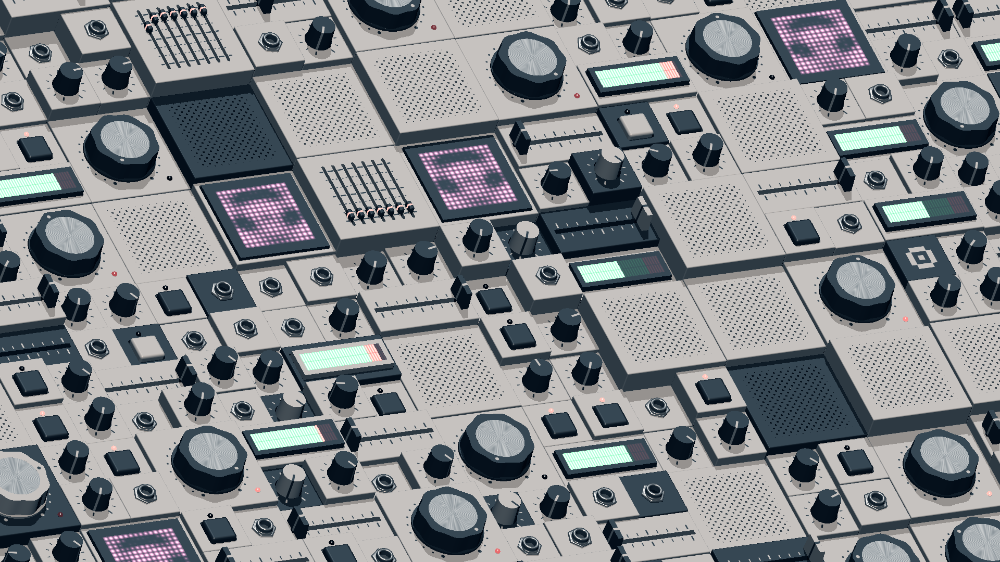

# Modules (You Overslept Dumbass!!)

4KB WebGL Intro

Appeared in Inércia Demoparty 2022 Combined Demo/Intro Compo

Does not work on firefox due to the use of DecompressionStream API!

- [📁 Download](https://github.com/0b5vr/modules-4k/releases)
- [💻 Watch the Intro Online](https://0b5vr.com/modules-4k/)
- [🎥 YouTube](https://youtu.be/Ay2ht_dgVw8)
- [🎺 pouët](https://www.pouet.net/prod.php?which=92807)

### Context

It was intended to be shown in the [Inércia Demoparty 2022 Shader Royale](https://youtu.be/IwseWSezE7U).
This shader is a result of one of my training processes.

But... I overslept!! I had to process my earlygame in only 10 minutes while others had full 30 minutes.
I panicked, and my half-asleep brain did not work correctly of course, had eliminated in the earlygame. You ruined, 0b5vr.

At the same party, there were people who were trying to make a demo within 24 hours, and they called the activity ["Fast Challenge"](https://fast-challenge.drastic.net/). Extreme Demomaking.
Being inspired by that, I decided to convert the shader into a 4KB intro, using a [4KB WebGL intro framework I've made in the past for no specific reason](https://github.com/0b5vr/js-4k-test).
Because of that, the visual content itself is easily coded using my 120 minutes.
(it's slightly optimized for 4KB compression + slightly flavored for the intro experience though)

### License

[CC BY-NC 4.0](LICENSE)
